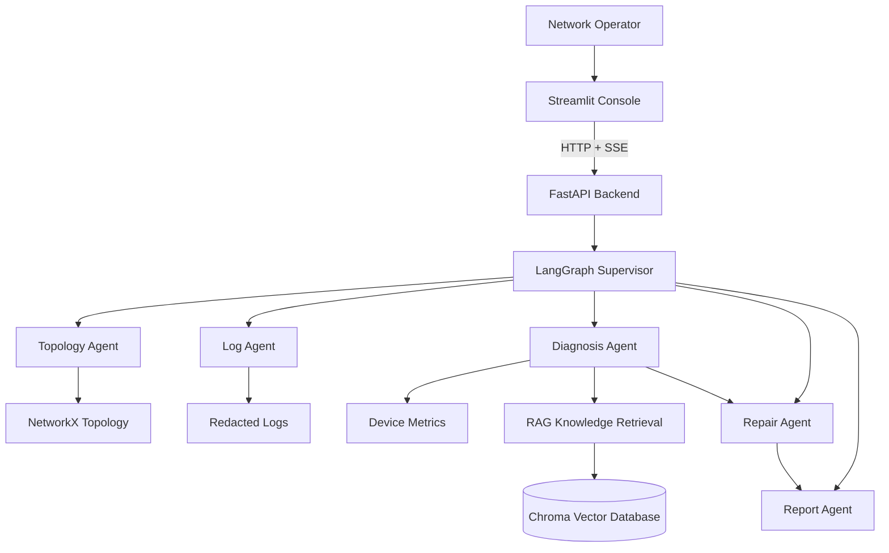
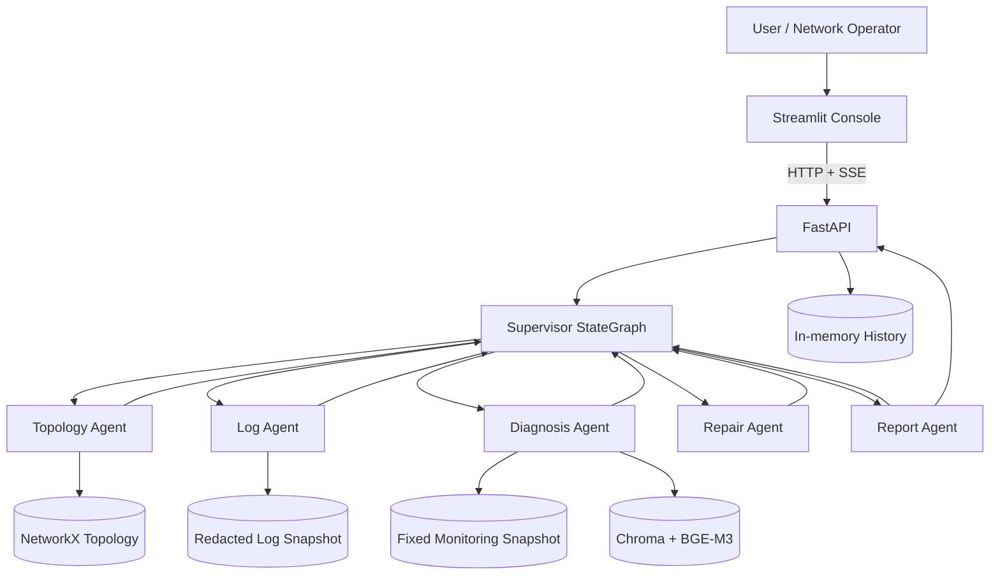

# 🚀 NetworkOps AI Agent

> 基于 LangGraph + Agentic RAG 的企业网络智能运维智能体平台


<p align="center">

企业网络故障诊断 · 根因分析 · RAG知识检索 · Agent工作流

</p>

<p align="center">


</p>


## ✨ Highlights

### 🤖 LangGraph Agent Workflow

基于 LangGraph 构建状态化网络运维 Agent 工作流：

- AgentState 状态管理
- 条件节点路由
- Tool Calling 工具调用
- 多步骤故障诊断流程
- 根因分析与报告生成

v0.2.0 新增 Supervisor Multi-Agent 工作流，按依赖顺序协调 Topology、Log、Diagnosis、Repair 和 Report Agent；Repair Agent 只生成需人工批准的计划，不执行网络变更。


### 🔍 Agentic RAG Knowledge Retrieval

结合网络运维知识库，实现：

- Markdown / TXT / 文本型 PDF 文档加载
- BGE-M3 Embedding
- Chroma 向量检索
- 故障案例匹配
- 证据引用与知识辅助诊断


### 🌐 Network Reasoning

基于 NetworkX 构建网络拓扑分析能力：

- 网络设备关系建模
- 链路路径查询
- 设备状态分析
- 多源故障证据关联


### 🧭 Network Digital Twin Preview

v0.2.1 新增独立的内存型 Network Digital Twin 基础层：

- 使用 Pydantic 表示设备、物理链路和带 UTC 时间戳的网络快照
- 使用无向 NetworkX 图构建七节点校园网络拓扑
- 查询设备、链路和邻居状态
- 通过原子更新接口演化设备与链路状态

当前 Preview 不连接真实设备，不支持 SNMP、NETCONF、故障注入或传播分析，也不执行自动配置修改；尚未接入现有 Agent 工作流。


### 🧪 Engineering Quality

面向工程化开发：

- FastAPI 后端服务
- Streamlit 可视化界面
- unittest 自动化测试
- GitHub Actions CI
- Python 3.11 兼容


### 🔐 Safety First

当前系统采用只读诊断模式：

- 不执行真实设备配置修改
- 不直接执行网络命令
- 高风险操作仅生成建议
- 保留人工确认边界

## 🎬 Demo


### Network Fault Diagnosis


输入故障描述：

```text
SW1 到 SW2 链路丢包，请结合拓扑、日志和知识库分析
```

Agent 执行流程：

```text
✓ Analyze network topology

✓ Query device status

✓ Retrieve operation knowledge

✓ Correlate multi-source evidence

✓ Generate root cause hypothesis

✓ Produce diagnosis report
```

诊断输出：

```text
Root Cause:

SW1-SW2 optical module degradation


Evidence:

- CRC error counter increasing
- Low optical power detected
- Interface abnormal logs found
- Similar historical fault case retrieved


Recommendation:

Perform manual inspection during maintenance window.
```

---

## 🏗 System Architecture


NetworkOps AI Agent architecture:




## 🔄 Agent Workflow


NetworkOps AI Agent uses LangGraph to build a stateful diagnosis workflow.


### General Agentic RAG Workflow


```text
User Query

    ↓

Query Understanding

    ↓

Evidence Collection

    ↓

Network Topology Analysis

    ↓

Monitoring Data Analysis

    ↓

Log Analysis

    ↓

Knowledge Retrieval (RAG)

    ↓

Root Cause Analysis

    ↓

Diagnosis Report Generation
```
## 🧪 Test Result


NetworkOps AI Agent includes automated tests for:

- Agent workflow execution
- Network diagnosis logic
- RAG retrieval pipeline
- API interfaces
- Tool calling


Current test status:

```text
Ran 121 tests

OK
```
## 🚀 Roadmap


### v0.1.0 ✅ Initial Release

Completed:

- LangGraph Agent Workflow
- Agentic RAG Knowledge Retrieval
- Network Fault Diagnosis Pipeline
- NetworkX Topology Simulation
- FastAPI Backend
- Streamlit Demo
- Automated Testing (92 tests)


### v0.2.0 ✅ Multi-Agent Architecture

Completed:

- Supervisor Agent
- Diagnosis Agent
- Topology Agent
- Log Analysis Agent
- Repair Agent
- Report Agent
- Agent collaboration and dependency-aware task delegation
- Shared typed state and bounded handoffs
- Read-only repair planning with human-approval requirements


### v0.2.1 ✅ Network Digital Twin Foundation

Completed:

- Pydantic device, link and network-state models
- In-memory NetworkX topology modeling
- Deterministic seven-node campus topology
- Validated device and link state evolution interfaces


### v0.3.0 🚧 Network Digital Twin

Planning:

- Dynamic network state simulation
- Fault injection system
- Device and link behavior modeling
- Fault propagation analysis
- Impact scope evaluation
- Agent integration


### v0.4.0 🚧 Autonomous Operations

Planning:

- Human-in-the-loop approval workflow
- Safe repair execution
- Operation audit logs
- Recovery verification
- Rollback mechanism


### v1.0.0 🚧 Enterprise Platform

Planning:

- Multi-user support
- Role-based access control
- Persistent database
- Docker deployment
- Monitoring platform integration
- Production environment adaptation

**中文名称：** 企业网络智能运维 Agent 平台

**原始项目：** Network Fault Diagnosis and Automated Operations Agent

> NetworkOps AI Agent 是一个基于 LangGraph、RAG、NetworkX 与只读工具调用，用于企业/校园网络故障证据关联场景，实现拓扑、指标、日志和知识库联合诊断的智能运维平台原型。

## 目录

- [Current Implementation](#current-implementation)
- [1. 项目简介](#1-项目简介)
- [2. 项目背景](#2-项目背景)
- [3. 核心设计原则](#3-核心设计原则)
- [4. 系统架构](#4-系统架构)
- [5. 功能特性](#5-功能特性)
- [6. 支持故障类型](#6-支持故障类型)
- [7. Agent 工作流程](#7-agent-工作流程)
- [8. 技术栈](#8-技术栈)
- [9. 项目目录结构](#9-项目目录结构)
- [10. Engineering Skills](#10-engineering-skills)
- [11. Detailed Roadmap](#11-detailed-roadmap)
- [12. Quick Start](#12-quick-start)
- [13. License](#13-license)

## Current Implementation

当前版本已经实现：

- 两套依赖注入式 LangGraph 工作流：通用七节点质量闭环与专用八节点网络诊断图；
- v0.2.0 Supervisor Multi-Agent 图：按需协调 Topology、Log、Diagnosis、Repair 与 Report Agent；
- v0.2.1 Network Digital Twin Foundation：设备、无向物理链路、UTC 状态快照和内存状态演化接口；
- 带文本层的 PDF、Markdown、TXT 文档加载，标题层级与 CLI 命令块保留；
- BGE-M3 Embedding、Chroma 集合重建与语义检索；
- 基于 NetworkX 的设备、关系、最短路径和双向接口查询；
- 固定且可复现的设备、接口、告警和脱敏日志快照；
- SW1–SW2 光模块退化演示，按多源证据计算规则诊断置信度；
- FastAPI 健康检查、SSE 节点进度、聊天接口和进程内历史；
- Streamlit 对话、引用文档、拓扑路径与固定设备指标快照展示；
- Python `unittest` 自动测试及确定性 Embeddings test double 离线测试策略。

当前版本是**只读诊断与修复规划原型**，不连接真实网络设备，不执行接口重启、配置修改、模块更换或自动修复。真实 LLM、监控平台和知识源需要通过已有回调契约注入。

### 当前限制与安全边界

- **PDF**：仅支持能够直接提取文本的文本型 PDF；不支持扫描 PDF，当前未集成 OCR。
- **Chroma**：当前采用集合重建模式。每次创建向量库都会清空并重建同名集合，不是完整的增量式持久化知识库；增量索引与集合生命周期管理属于后续规划。
- **API**：当前 FastAPI 接口仅用于本地演示，未实现用户认证、权限控制、限流或 CORS 策略。禁止将当前服务直接暴露到公网或其他非可信网络。
- **人工确认**：当前仅实现基于规则的人工确认策略，即在高风险建议中要求维护窗口和人工批准；尚未实现 LangGraph `interrupt` 暂停、checkpoint 恢复、审批人身份或审批记录。
- **Digital Twin Preview**：当前仅支持内存中的网络拓扑建模、状态表示与状态演化基础接口；不连接真实设备，不支持 SNMP、NETCONF、故障注入、故障传播或自动配置修改，也尚未接入 Agent 工作流。

---

## 1. 项目简介

NetworkOps AI Agent 面向企业和校园网络运维场景，将知识检索、网络拓扑、监控指标与日志证据放入同一个可追踪的 Agent 状态机中。它不是把大模型包装成聊天框，而是用条件图执行结构化查询、关联结果、生成诊断假设，并检查答案是否有证据支撑。通用图允许注入查询分析器来决定意图；当前 SW1–SW2 演示使用固定规则计划，始终按需检查四类证据，并非现成的 LLM 自主工具选择。

当前闭环覆盖：

```text
故障理解
  ↓
拓扑 / 指标 / 日志 / 知识采集
  ↓
证据关联与根因假设
  ↓
只读排查建议与风险提示
  ↓
人工决策（系统仅提示，不执行审批）
  ↓
验证计划
```

运行时审批、自动执行和真实恢复验证尚未实现，见 [Detailed Roadmap](#11-detailed-roadmap)。

## 2. 项目背景

传统网络故障处理通常依赖人工串联多个系统：

```text
用户反馈 → 查看设备 → 检查接口与日志 → 查阅手册/历史工单 → 定位原因 → 制定变更 → 验证恢复
```

常见问题包括：

- 排查链路长，拓扑、监控、日志和知识分散；
- 根因定位依赖资深工程师经验；
- 告警描述现象，却不能自动建立跨数据源因果关联；
- 配置命令风险高，不能让生成模型绕过审批直接执行；
- 诊断过程缺少统一状态、证据引用和可重复测试。

本项目以 Agentic RAG 为核心，把“选择数据源、收集证据、形成假设、检查答案”建模为显式 LangGraph 节点与条件边，从而让诊断过程更可观察、更可测试。

## 3. 核心设计原则

### 3.1 Agent First

Agent 不等于聊天机器人。当前工作流具备：

- `AgentState` / `DiagnosisState` 共享状态；
- 意图分析与条件路由；
- 由状态和条件边控制的拓扑、监控、日志和 RAG 数据源选择；
- 低质量检索时的 Query Rewrite；
- 答案不合格时的生成循环；
- 仅针对 `ConnectionError` 和 `TimeoutError` 的有限重试；
- 最大三轮质量预算，避免无限循环。

### 3.2 Tool Safety

当前监控与日志工具采用 LangChain `StructuredTool` 契约，输入字段固定并经过验证；拓扑与 RAG 通过可注入回调连接工作流。业务错误返回结构化结果，而不是把任意命令交给模型执行。仓库提供的是 Tool Calling 契约和编排框架；演示入口使用确定性回调，不包含 LLM 驱动的自主工具选择。

```text
LangGraph Agent
      ↓
Typed Callbacks / StructuredTool
      ↓
NetworkX / Fixed Monitoring Snapshot / Redacted Logs / Chroma
```

当前安全边界：

- 日志工具只接受数据源、时间范围、查询文本和数量限制；
- 不接受原始设备命令，不执行 SSH 或配置变更；
- 证据带有 `TOPO-*`、`METRIC-*`、`LOG-*`、`KB-*` 引用；
- 默认检查器拒绝未知证据编号，以及“已自动执行”“自动执行修复”“已重启接口”“已更换光模块”“已修改配置”等越权表述；
- 参数错误、未知设备和未知接口返回明确错误码。

当前 API 也未实现用户认证、权限控制、限流和 CORS 策略，仅限本地演示；权限系统、持久化审计和操作白名单执行器均尚未实现。

### 3.3 Evidence-based Diagnosis

诊断输出区分事实与推断：

```text
Evidence（事实）
- SW1-Gi0/1 与 SW2-Gi0/24 属于同一物理链路
- CRC 和输入错误计数持续增长
- 接收光功率低于阈值
- 同一时间窗口存在接口错误日志
- 历史案例包含相同症状

Reasoning（推断）
- 多类独立证据共同支持光模块退化假设
- 规则诊断置信度为 80%，但不是统计校准后的真实概率
```

缺失任何证据时，分数会下降；证据不足时，结论会标记为“待验证假设”。

### 3.4 Human-in-the-loop（基于规则的人工确认策略）

当前实现不是可暂停、可恢复的运行时审批流程，而是基于规则的人工确认策略。系统不会执行状态变更；对于更换光模块等高风险建议，答案必须明确要求维护窗口和人工批准，并提供验证与回退条件。

| 风险级别 | 当前处理方式 | 示例 |
| --- | --- | --- |
| LOW | 允许给出只读检查步骤 | 查询 CRC、光功率、接口状态 |
| MEDIUM | 仅给出建议，不自动执行 | 扩大监控采样、现场检查跳纤 |
| HIGH | 明确要求维护窗口与人工批准 | 更换光模块、修改网络配置 |

当前没有 LangGraph `interrupt` 暂停、checkpoint 恢复、审批人身份或审批记录。真正的审批 API、审批状态机和操作执行器属于未来计划。

### 3.5 Reproducibility

当前仓库支持：

- Python 3.11 本地运行；
- 固定拓扑、指标和日志快照；
- 确定性 Embeddings test double 测试，不下载模型；
- 标准库 `unittest` 全量回归；
- `compileall` 与 `pip check` 验证。

Docker 尚未提供；仓库已有基础 GitHub Actions CI。

## 4. 系统架构

<!-- Architecture diagram: current implementation -->



当前架构说明：

- FastAPI 通过应用工厂接收已编译工作流；默认模块级应用不虚构 Agent，聊天接口会返回 HTTP 503；
- v0.1 专用演示入口保留原单 Agent 诊断图；v0.2 显式入口装配 Supervisor Multi-Agent、NetworkX、固定监控/日志和 Chroma；
- 通用工作流允许部署方注入真实生成器、检查器和数据源；
- 当前没有关系数据库、业务数据库、网络模拟器或真实设备客户端；Multi-Agent 采用单一共享状态图、顺序调度，不使用子图或并行 Agent。Chroma 当前采用清空同名集合后重新写入的集合重建模式，不支持增量索引。

## 5. 功能特性

| 功能 | 状态 | 描述 |
| --- | --- | --- |
| LangGraph Agent Workflow | ✅ Current | 条件边、循环、有限重试和结构化错误终止 |
| Supervisor Multi-Agent | ✅ Current | 依赖感知路由、共享 TypedDict 状态、有限交接和专业 Agent 降级处理 |
| 网络拓扑建模 | ✅ Current | 从 JSON 加载设备与关系，查询最短路径、邻居和双向接口 |
| 监控 Tool | ✅ Current | 查询固定设备、接口和告警快照 |
| 日志 Tool | ✅ Current | 时间范围过滤、脱敏记录、证据引用和结构化错误 |
| RAG | ✅ Current | 文本型 PDF/Markdown/TXT、结构化切片、BGE-M3、Chroma 集合重建与检索；无 OCR |
| Root Cause Hypothesis | ✅ Current | 基于五类规则证据生成根因假设与置信度 |
| Hallucination Checker | ✅ Current | 校验根因、规则分数、证据编号和安全声明 |
| FastAPI SSE | ✅ Current | `start → node* → answer/error` 节点级流式事件 |
| Streamlit Console | ✅ Current | 对话、引用、拓扑路径和固定指标快照展示 |
| 进程内会话历史 | ✅ Current | 按会话隔离；重启清空，多 worker 不共享 |
| 人工确认策略 | ✅ Current | 通过规则要求维护窗口和人工批准；没有 interrupt、checkpoint 或审批记录 |
| 故障注入 | 🧭 Planned | 设备离线、端口关闭、拥塞和组合故障注入 |
| 自动修复 | 🧭 Planned | 白名单操作、风险分级、审批、执行、验证与回退 |
| Incident Report 文件导出 | 🧭 Planned | 结构化事件报告与 PDF/Markdown 导出 |
| Docker Compose | 🧭 Planned | 后端、前端和数据服务容器化 |

## 6. 支持故障类型

当前“支持”指固定快照查询或演示诊断能力，不代表能够向环境注入故障。

| 场景 | 当前支持度 | 示例 |
| --- | --- | --- |
| SW1–SW2 高丢包/光模块退化 | 完整演示 | 链路保持 up，但 CRC、输入错误增长且接收光功率越界 |
| 设备在线/降级/离线 | 状态查询样例 | `core-sw-01` 在线、`edge-rtr-01` 降级、`access-sw-01` 离线 |
| 接口 up/down | 状态查询样例 | 查询管理状态、运行状态、流量和丢包率 |
| 告警过滤 | 查询样例 | 按设备、严重级别和活动状态过滤固定告警 |
| 服务停止 | 未实现 | Roadmap：服务探测 Tool 与服务恢复审批 |
| 链路拥塞 | 未实现 | Roadmap：时序指标、容量基线和拥塞诊断 |
| 多故障组合 | 未实现 | Roadmap：故障注入与多假设排序 |

## 7. Agent 工作流程

### 7.1 通用 Agentic RAG 质量闭环

```text
QueryAnalyzer → Router
                    ├─ general → Generator
                    └─ network intent → Retrieval

Retrieval → DocumentGrader
                 ├─ relevant → Generator
                 └─ low score → QueryRewrite → Router

Generator → HallucinationChecker
                 ├─ approved → END
                 └─ rejected → Generator（共享最多三轮预算）
```

通用图通过回调注入分析、检索、生成和检查能力，不绑定模型供应商。

### 7.2 网络诊断专用图

```text
QueryAnalyzer
  → TopologyTool
  → MonitorTool
  → LogTool
  → RAG
  → EvidenceCorrelator
  → Generator
  → HallucinationChecker
       ├─ approved → END
       └─ rejected → Generator（最多三轮）
```

`DiagnosisPlan.required_sources` 控制条件边，未请求的证据节点会被跳过。读取节点仅对连接错误和超时进行最多三次重试。

## 8. 技术栈

| 分类 | 当前技术 |
| --- | --- |
| Runtime | Python 3.11 |
| Backend | FastAPI、Uvicorn、Pydantic、pydantic-settings |
| Agent | LangGraph、LangChain Core、StructuredTool |
| Network | NetworkX `MultiDiGraph` |
| RAG | LangChain Text Splitters、BGE-M3、Sentence Transformers、Chroma |
| Documents | PyMuPDF4LLM（仅文本型 PDF、无 OCR）、Markdown、TXT |
| Frontend | Streamlit、标准库 `urllib` SSE 客户端 |
| Testing | `unittest`、pytest（可选开发依赖）、确定性 Embeddings test double、`compileall`、`pip check` |
| Persistence | 本地 Chroma 集合重建模式；会话历史为进程内存 |
| Deployment | 本地 Python 进程；Docker 尚未实现 |

项目当前**没有** SQLAlchemy、关系数据库、Ruff 或 Docker Compose；pytest 仅作为可选开发依赖，仓库已有基础 GitHub Actions CI。

## 9. 项目目录结构

```text
.
├── knowledge/
│   └── diagnosis/
│       └── optical_module_degradation.md
├── topology/
│   └── sw1_sw2.json
├── docs/
│   └── superpowers/
│       ├── plans/
│       └── specs/
├── src/network_agent_rag/
│   ├── agents/
│   │   ├── multi_agent/
│   │   │   ├── state.py
│   │   │   ├── supervisor.py
│   │   │   └── workflow.py
│   │   ├── diagnosis_workflow.py
│   │   ├── log_tools.py
│   │   ├── monitoring_tools.py
│   │   └── workflow.py
│   ├── api/
│   │   ├── history.py
│   │   ├── router.py
│   │   └── schemas.py
│   ├── core/
│   │   └── config.py
│   ├── domain/
│   │   └── topology.py
│   ├── digital_twin/
│   │   ├── models.py
│   │   ├── network_model.py
│   │   ├── simulator.py
│   │   └── state.py
│   ├── frontend/
│   │   ├── app.py
│   │   └── client.py
│   ├── infrastructure/
│   │   └── __init__.py
│   ├── rag/
│   │   ├── documents.py
│   │   └── vector_store.py
│   ├── demo.py
│   ├── demo_main.py
│   ├── multi_agent_demo.py
│   ├── multi_agent_main.py
│   └── main.py
├── tests/
├── .env.example
├── .python-version
├── README.md
└── requirements.txt
```

`infrastructure/` 当前仅声明未来外部系统集成边界，没有数据库或监控平台客户端实现。

## 10. Engineering Skills

### 10.1 Superpowers

| 方法 | 在项目中的用途 |
| --- | --- |
| brainstorming | 明确 Agent 定位、用户场景和安全边界 |
| writing-plans | 将 RAG、工作流、API、前端和诊断场景拆成可验证阶段 |
| test-driven-development | 先定义工作流、Tool、SSE 和诊断规则的行为测试 |
| systematic-debugging | 作为故障定位方法论；当前仓库未集成专用调试框架 |
| requesting-code-review | 在功能完成后检查实现与需求一致性 |

这些 skills 属于工程协作方法，不是运行时依赖。

### 10.2 Ponytail

Ponytail 用于控制工程复杂度：优先复用标准库和现有依赖，避免为演示场景引入数据库、消息队列或额外前端框架，并持续检查文档是否描述了不存在的能力。

### 10.3 AI Agent Engineering

- LangGraph StateGraph 与条件边；
- Agent State Management；
- Structured Tool Calling；
- Agentic RAG 与 Query Rewrite；
- Evidence Correlation；
- Hallucination Checking；
- 有限循环、重试与结构化错误终止。

### 10.4 Software Engineering

- `src/` 模块化工程结构；
- Pydantic API 契约；
- 应用工厂与依赖注入；
- 标准库 `unittest` 回归测试；
- 中文技术文档与可复现演示。

仓库已配置 GitHub Actions CI；容器发布、静态检查和生产部署流水线仍属于后续规划。

## 11. Detailed Roadmap

Phase 1 已在 v0.2.0 实现；Phase 2 的 Foundation Preview 已在 v0.2.1 实现。完整 Digital Twin 及其余阶段均为 **Planned**，不是当前实现。

### Phase 1 — Supervisor Multi-Agent（Completed in v0.2.0）

- Supervisor Agent；
- Diagnosis Agent；
- Topology Agent；
- Log Agent；
- Repair Agent；
- Report Agent；
- Agent 间依赖感知任务委派、共享状态和失败降级；
- Repair Agent 仅生成计划，不执行变更；
- 首版为顺序单图，不包含并行、子图或 Checkpointer。

### Phase 2 — Network Digital Twin（Foundation Preview in v0.2.1）

当前支持：

- 网络设备与无向物理链路建模；
- 带 UTC 时间戳的网络状态快照；
- 设备与链路状态演化基础接口；
- 固定七节点校园网络拓扑。

v0.3.0 规划：

- 可控故障注入；
- 故障传播和影响范围分析；
- 与 Multi-Agent 诊断流程集成；
- 配置变更沙箱；
- 修复前影响评估与修复后回归验证。
- Safe Auto Repair：白名单操作、风险分级、人工审批、执行、验证与回退。

### Phase 3 — Vue3 Dashboard（Planned）

- Vue3 + TypeScript 运维控制台；
- 交互式拓扑图与故障路径高亮；
- 告警、证据、审批和事件时间线；
- 用户、角色与权限管理。

### Phase 4 — Benchmark Evaluation（Planned）

- 网络运维复杂问题测试集；
- 检索准确率、答案准确率、幻觉率和平均迭代次数；
- 多跳拓扑与厂商命令差异评测；
- Bad Case 分析与回归基线。

### Phase 5 — Open Source Release（Planned）

- Dockerfile 与 Docker Compose；
- 发布自动化、代码格式与静态检查；
- 安全策略、贡献指南与 Issue 模板；
- Chroma 增量索引与集合生命周期管理；
- 可选真实 Prometheus/Zabbix/ELK/LLM 适配器。

## 12. Quick Start

### 12.1 环境要求

- Python 3.11；
- 首次运行完整演示时可访问 Hugging Face；
- BGE-M3 模型约 4.6 GB，请预留磁盘空间；
- 文档处理仅支持带文本层的 PDF，不支持扫描 PDF，且不包含 OCR 能力；
- Windows PowerShell，或能够设置 `PYTHONPATH=src` 的 Linux/macOS shell。

### 12.2 安装依赖

Windows PowerShell：

```powershell
py -3.11 -m venv .venv
.\.venv\Scripts\Activate.ps1
python -m pip install --upgrade pip
python -m pip install -r requirements.txt
Copy-Item .env.example .env
$env:PYTHONPATH = "src"
```

Linux/macOS：

```bash
python3.11 -m venv .venv
source .venv/bin/activate
python -m pip install --upgrade pip
python -m pip install -r requirements.txt
cp .env.example .env
export PYTHONPATH=src
```

需要运行包含 pytest 的完整开发验证时，可在已激活的虚拟环境中安装项目及开发依赖：

```powershell
python -m pip install -e ".[dev]"
```

### 12.3 启动基础 API

```powershell
uvicorn network_agent_rag.main:app --host 127.0.0.1 --port 8000
```

基础入口提供健康检查和 OpenAPI，但没有注入工作流；调用聊天接口会返回 HTTP 503。当前 API 没有用户认证、权限控制、限流或 CORS 策略，仅用于本地演示，禁止直接暴露到公网或其他非可信网络。

```text
GET http://127.0.0.1:8000/api/v1/health
OpenAPI http://127.0.0.1:8000/docs
```

### 12.4 启动 SW1–SW2 完整演示

```powershell
$env:PYTHONPATH = "src"
uvicorn network_agent_rag.demo_main:app --host 127.0.0.1 --port 8000
```

首次启动会下载 BGE-M3，并在 `data/chroma/sw1_sw2_demo/` 创建 Chroma 数据。当前实现会在每次初始化时清空并重建同名集合，不会执行增量索引；演示入口不建议开启 `--reload`，避免重复初始化模型和向量库。

### 12.5 启动 v0.2 Multi-Agent 演示

```powershell
$env:PYTHONPATH = "src"
uvicorn network_agent_rag.multi_agent_main:app --host 127.0.0.1 --port 8000
```

该入口保留与 v0.1 相同的 FastAPI/SSE 契约，但节点进度会显示 Supervisor、Topology、Log、Diagnosis、Repair 和 Report Agent。Repair Agent 只生成 `not_executed` 修复计划。

### 12.6 启动 Streamlit

保持 FastAPI 运行，在第二个终端执行：

```powershell
.\.venv\Scripts\Activate.ps1
$env:PYTHONPATH = "src"
$env:NETWORK_AGENT_API_URL = "http://127.0.0.1:8000"
streamlit run src/network_agent_rag/frontend/app.py
```

浏览器访问：`http://127.0.0.1:8501`

推荐演示问题：

```text
SW1 到 SW2 链路丢包，请结合拓扑、日志和知识库分析
```

### 12.7 调用 SSE API

```bash
curl -N -X POST http://127.0.0.1:8000/api/v1/chat \
  -H "Content-Type: application/json" \
  -d '{"session_id":"demo-1","query":"分析 SW1 到 SW2 的链路丢包"}'
```

查询进程内历史：

```bash
curl "http://127.0.0.1:8000/api/v1/history?session_id=demo-1"
```

### 12.8 运行测试

```powershell
$env:PYTHONPATH = "src"
pytest
python -m unittest discover -s tests -v
python -m compileall src tests
python -m pip check
```

测试使用确定性 Embeddings test double（包含轻量 FakeEmbeddings 实现），不下载 BGE-M3，也不会访问真实网络设备。

### 12.9 Docker

当前仓库没有 Dockerfile 或 Docker Compose，暂不支持 Docker 启动。容器化发布已列入 Roadmap Phase 5。

## 13. License

NetworkOps AI Agent 的原创代码采用 [MIT License](LICENSE)，版权归 `2026 NetworkOps AI Agent Contributors` 所有。

第三方组件和 BGE-M3 模型继续适用各自许可证，MIT License 不会替代或重新许可这些第三方内容。完整清单与兼容性结论见 [THIRD_PARTY_NOTICES.md](THIRD_PARTY_NOTICES.md)。

特别说明：PDF 解析依赖 PyMuPDF4LLM，其许可为 GNU AGPL v3 / Artifex 商业双许可。使用 PDF 功能时必须遵守适用的 AGPL 义务或取得有效商业许可；不能将整个可安装依赖栈描述为纯 MIT。企业、闭源或网络服务场景应在发布前单独完成许可证评估。
