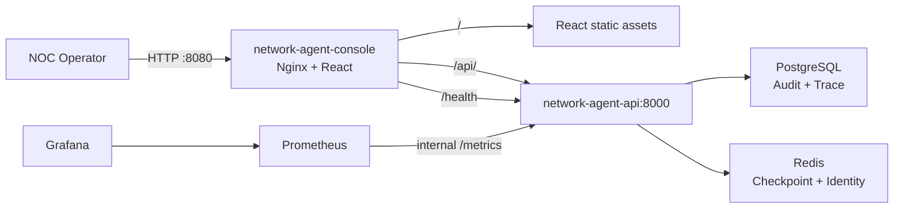

# NetworkOps Operator Console

NetworkOps Operator Console is a read-only React projection over the existing
Enterprise Console API. The production image serves static assets and proxies
API requests through one non-root Nginx process; it does not add or change any
FastAPI route.

## Architecture



The public gateway behavior is:

| Path | Destination | Notes |
|---|---|---|
| `/` | React Console | Unknown static paths fall back to `index.html`. |
| `/api/` | FastAPI | The original path and Authorization header are preserved. |
| `/health` | FastAPI | Reports API and storage readiness. |
| `/console-health` | Console Nginx | Used by the container health check. |
| `/metrics` | `404` | Public access remains blocked; Prometheus connects directly to the API service. |

The `/api/` proxy uses HTTP/1.1, disables buffering and caching, sets a one-hour
read timeout, and emits `X-Accel-Buffering: no` so existing SSE streams retain
their deployment behavior.

## Build and deploy

Configure the existing production environment variables outside source control.
The Console introduces no new secret or environment variable.

```powershell
docker compose config
docker compose build network-agent-console
docker compose up -d
```

Open `http://127.0.0.1:8080` by default. Override the loopback gateway port with
the existing `NETWORKOPS_GATEWAY_PORT` variable. PostgreSQL, Redis, Prometheus,
and Grafana retain their existing Compose configuration and data volumes.

To validate the Console image build independently:

```powershell
docker build -f console/Dockerfile -t networkops-operator-console:phase3 console
```

Run the image through Compose so Nginx can resolve the required
`network-agent-api` upstream on the shared network.

## JWT usage

Paste a valid JWT into the Console authentication screen. The token is held only
in React component memory and is sent as `Authorization: Bearer <token>` to the
relative `/api/v1/console/*` endpoints.

- The token is not stored in browser persistent storage, cookies, or the URL.
- HTTP 401 clears the in-memory token and returns to the authentication screen.
- HTTP 403 retains the token and displays an authorization error.
- Reloading or closing the page discards the token.

## RBAC permissions

The Console does not define roles or permissions. It relies on the existing API
authorization boundary:

- `VIEW_INCIDENT` allows incident list and incident detail projections.
- `VIEW_TRACE` allows Dashboard, Trace, Governance, Policy, and Evaluation projections.

Authentication does not imply either permission. The backend remains the
authority for every request.

## Security boundaries

- The Console is read-only and calls only the existing Console GET endpoints.
- The static client cannot execute repairs, approve work, update Checkpoints, or
  invoke Policy or Governance mutation operations.
- Nginx runs as the image's unprivileged `nginx` user on port 8080.
- Public `/metrics` access remains disabled; monitoring stays on the internal
  Compose network.
- The reference deployment does not terminate TLS. Production operators must
  place it behind a trusted TLS endpoint and apply their organization’s network,
  browser, and secret-management controls.
- The Console does not implement login, token refresh, token revocation, user
  management, or client-side authorization enforcement.
